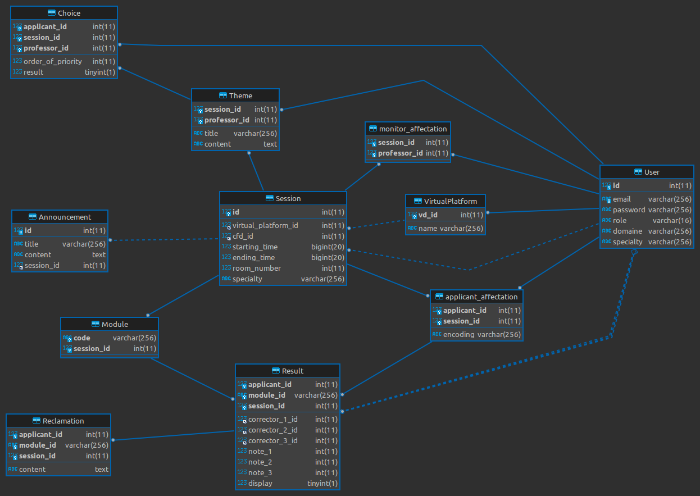

# Contributing guide

for more information check [The Rust Programming language Book](https://doc.rust-lang.org/book/ch01-01-installation.html#installing-rustup-on-windows)

## Installing rust

### windows

On Windows, go to https://www.rust-lang.org/tools/install and follow the instructions for installing Rust. At some point in the installation, you’ll receive a message explaining that you’ll also need the MSVC build tools for Visual Studio 2013 or later.

To acquire the build tools, you’ll need to install Visual Studio 2022. When asked which workloads to install, include:

    “Desktop Development with C++”
    The Windows 10 or 11 SDK
    The English language pack component, along with any other language pack of your choosing


### linux
  ```bash
  curl --proto '=https' --tlsv1.2 https://sh.rustup.rs -sSf | sh
  ```

### macos
  ```bash
  curl --proto '=https' --tlsv1.2 https://sh.rustup.rs -sSf | sh
  ```

## Setting up editor

check https://www.rust-lang.org/tools and select your favorite editor and follow the instructions to use rust in it

## Using the project
* Clone the repository
* open the project in code editor
* check .env file and verify if the database url exists change it if necessary 
* open a terminal
* use the following commands:

```bash
  cargo build # compiles the project
  cargo test # runs the unit tests
  cargo run # runs the project
```

## Database 


<p style="color:red;" align="center">
🚧 Work in progress 🚧
</p>



<p style="color:red;" align="center">
🚧 Work in progress 🚧
</p>

